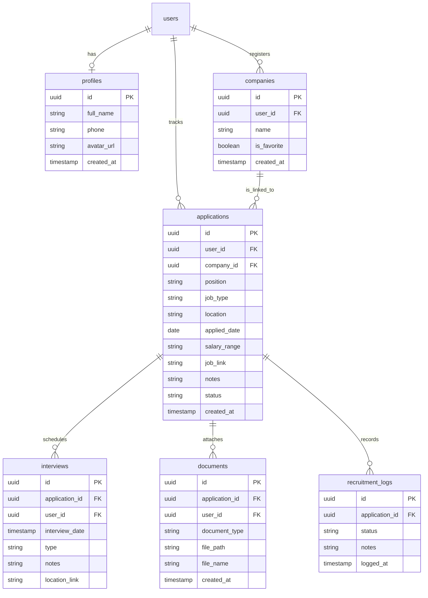
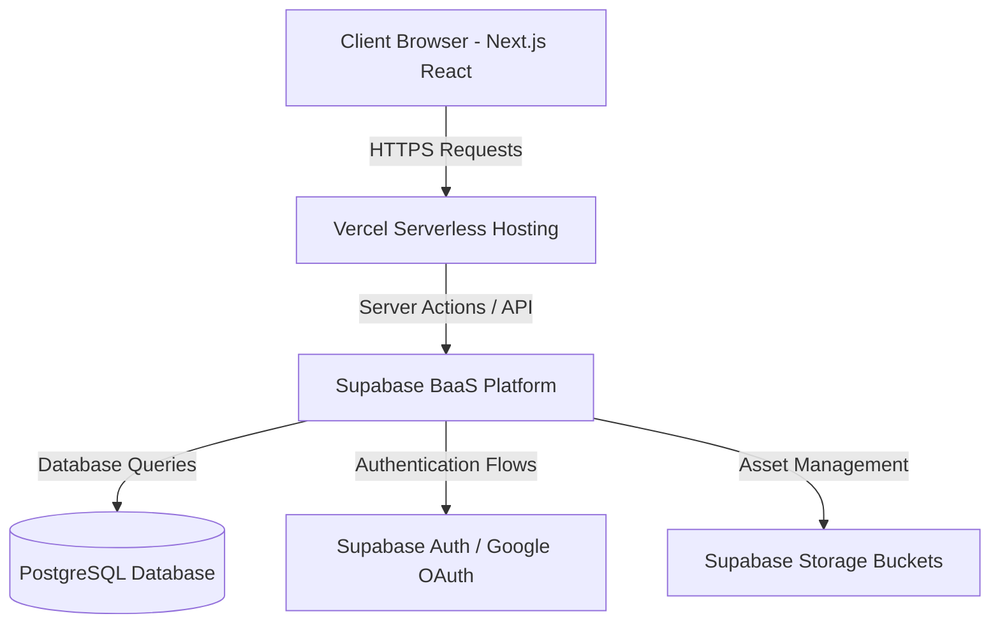

# CareerCompass – Sistem Manajemen Lamaran Kerja & Magang

CareerCompass adalah aplikasi web modern SaaS-dashboard terpusat yang dirancang khusus untuk membantu mahasiswa, fresh graduate, dan pencari kerja mencatat, mengelola, dan memantau seluruh recruitment pipeline mereka secara real-time.

Aplikasi ini siap digunakan sebagai portfolio kelas dunia (Software Engineer / Apple Developer Academy) dengan integrasi Next.js 15, Tailwind CSS v4, dan Supabase PostgreSQL.

---

## 🚀 Fitur Utama

- **Dashboard Karir Interaktif**: Informasi ringkasan total lamaran, status rekrutmen aktif, charts visual sebaran status, serta info wawancara terdekat.
- **Manajemen Lamaran (CRUD)**: Catat posisi, jenis pekerjaan (Internship, Full Time, Part Time, Contract), lokasi, nominal gaji, link lowongan, dan catatan penting.
- **Sistem Status Real-time & Visual Timeline**: Pelacakan status lamaran mulai dari *Applied*, *Screening*, *Technical Test*, *Interview*, *HR Interview*, *Offered*, *Accepted*, hingga *Rejected*.
- **Kalender Agenda Interview**: Kelola jadwal, tanggal rapat, info tautan wawancara daring (Google Meet / Zoom), serta pengingat visual.
- **Penyimpanan Dokumen Terpadu**: Unggah CV (PDF), Cover Letter, dan Sertifikat pendukung langsung ke awan (Supabase Storage) dengan limit ukuran file 5MB.
- **Ekspor Laporan**: Unduh laporan lamaran Anda kapan saja dalam format **PDF** dan **Excel**.
- **Mode Demo Mandiri (Mock Mode)**: Kemampuan lari lokal instan menggunakan HTML5 LocalStorage jika kunci API Supabase belum dikonfigurasi.

---

## 🛠️ Tech Stack & Arsitektur

- **Frontend**: React, Next.js 15 (App Router), TypeScript, Tailwind CSS v4, Lucide Icons.
- **Backend / BaaS**: Next.js Server Actions & Supabase.
- **Database**: PostgreSQL (Supabase DB).
- **Authentication**: Supabase Auth (Google Single Sign-in / Gmail).
- **Storage**: Supabase Storage Buckets (File upload PDF).
- **Deployment**: Vercel.

---

## 📊 Entity Relationship Diagram (ERD)



---

## 🏛️ Diagram Arsitektur Sistem



---

## 📝 Panduan API & Database Setup

Seluruh query tabel, trigger profil otomatis ketika registrasi OAuth, dan pencatatan timeline history otomatis ketika mengubah status lamaran telah diprogram dalam SQL terpadu.

Buka panel **Supabase SQL Editor**, salin dan jalankan script schema berikut:
👉 [schema.sql](file:///d:/PROJECT/job%20Application%20Tracker/supabase/schema.sql)

---

## ⚙️ Instalasi Lokal

### 1. Kloning Workspace & Pasang Dependensi
```bash
# Pastikan Anda berada pada folder root project
npm install
```

### 2. Konfigurasi Environment Variables
Salin file `.env.example` menjadi `.env.local` dan lengkapi kredensial Supabase Anda:
```bash
cp .env.example .env.local
```

Isi file `.env.local`:
```env
NEXT_PUBLIC_SUPABASE_URL=https://your-supabase-project.supabase.co
NEXT_PUBLIC_SUPABASE_ANON_KEY=your-supabase-anon-key
```
> 💡 *Jika Anda membiarkan kunci bernilai placeholder di atas, aplikasi secara cerdas akan otomatis mengaktifkan **Demo Mode** berbasis LocalStorage agar Anda dapat melakukan demo instan tanpa database.*

### 3. Jalankan Server Development
```bash
npm run dev
```
Buka [http://localhost:3000](http://localhost:3000) di browser Anda.

---

## 🚀 Panduan Deployment ke Vercel

1. Buat repositori baru di GitHub dan lakukan push code.
2. Masuk ke **Vercel** dan buat project baru dengan mengimpor repositori Anda.
3. Pada bagian **Environment Variables** di dashboard Vercel, tambahkan variabel:
   - `NEXT_PUBLIC_SUPABASE_URL`
   - `NEXT_PUBLIC_SUPABASE_ANON_KEY`
4. Klik **Deploy** dan aplikasi CareerCompass Anda siap diakses secara online!
