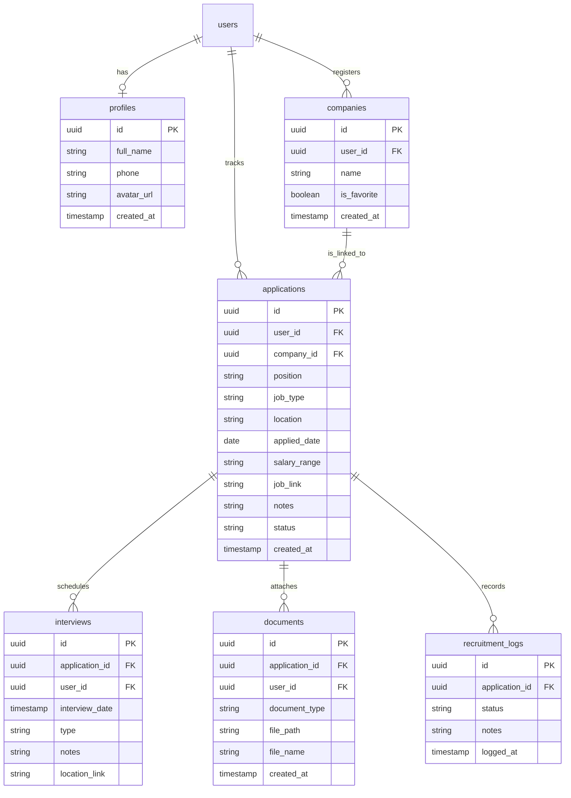
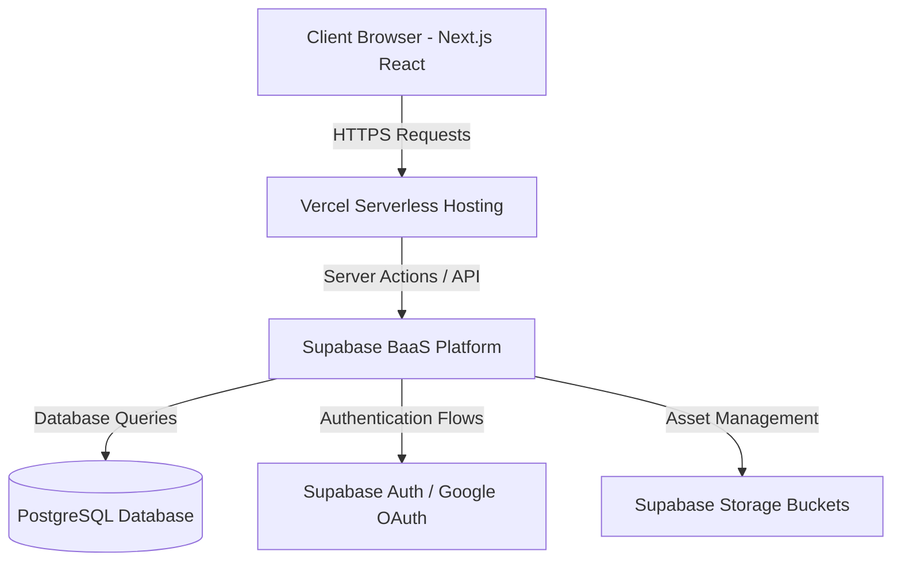

# CareerCompass – Job Application & Internship Management System


[](https://job-application-tracker-gamma-one.vercel.app)


CareerCompass is a modern centralized SaaS-dashboard web application designed specifically to help students, fresh graduates, and job seekers track, manage, and monitor their entire recruitment pipeline in real-time.

This application is ready to be used as a world-class portfolio (Software Engineer / Apple Developer Academy) with integrations of Next.js 15, Tailwind CSS v4, and Supabase PostgreSQL.

---

## 🚀 Key Features

- **Interactive Career Dashboard**: Summary information of total applications, active recruitment statuses, visual status distribution charts, and upcoming interview schedules.
- **Application Management (CRUD)**: Log position, job type (Internship, Full Time, Part Time, Contract), location, salary range, job link, and important notes.
- **Real-time Status System & Visual Timeline**: Track application status starting from *Applied*, *Screening*, *Technical Test*, *Interview*, *HR Interview*, *Offered*, *Accepted*, to *Rejected*.
- **Interview Schedule Calendar**: Manage schedules, meeting dates, online interview links (Google Meet / Zoom), and visual reminders.
- **Integrated Document Storage**: Upload CV (PDF), Cover Letters, and supporting certificates directly to the cloud (Supabase Storage) with a 5MB file size limit.
- **Export Reports**: Download your application reports anytime in **PDF** and **Excel** formats.
- **Standalone Demo Mode (Mock Mode)**: Ability to run locally instantly using HTML5 LocalStorage if Supabase API keys are not configured.

---

## 🛠️ Tech Stack & Architecture

- **Frontend**: React, Next.js 15 (App Router), TypeScript, Tailwind CSS v4, Lucide Icons.
- **Backend / BaaS**: Next.js Server Actions & Supabase.
- **Database**: PostgreSQL (Supabase DB).
- **Authentication**: Supabase Auth (Google Single Sign-in / Gmail).
- **Storage**: Supabase Storage Buckets (File upload PDF).
- **Deployment**: Vercel.

---

## 📊 Entity Relationship Diagram (ERD)



---

## 🏛️ System Architecture Diagram



---

## 📝 API & Database Setup Guide

All table queries, automatic profile creation triggers upon OAuth registration, and automatic timeline logs upon status changes have been consolidated into a single unified SQL script.

Open the **Supabase SQL Editor** panel, copy, and run the following schema script:
👉 [schema.sql](file:///d:/PROJECT/job%20Application%20Tracker/supabase/schema.sql)

---

## ⚙️ Local Installation

### 1. Clone Workspace & Install Dependencies
```bash
# Make sure you are in the project root folder
npm install
```

### 2. Configure Environment Variables
Copy the `.env.example` file to `.env.local` and fill in your Supabase credentials:
```bash
cp .env.example .env.local
```

Fill in the `.env.local` file:
```env
NEXT_PUBLIC_SUPABASE_URL=https://your-supabase-project.supabase.co
NEXT_PUBLIC_SUPABASE_ANON_KEY=your-supabase-anon-key
```
> 💡 *If you leave the keys as placeholder values above, the application will intelligently and automatically activate **Demo Mode** based on LocalStorage so you can do an instant demo without a database.*

### 3. Run Development Server
```bash
npm run dev
```
Open [http://localhost:3050](http://localhost:3050) in your browser.

---


## 🚀 Deployment to Vercel Guide

1. Create a new repository on GitHub and push the code.
2. Login to **Vercel** and create a new project by importing your repository.
3. Under the **Environment Variables** section in the Vercel dashboard, add the variables:
   - `NEXT_PUBLIC_SUPABASE_URL`
   - `NEXT_PUBLIC_SUPABASE_ANON_KEY`
4. Click **Deploy** and your CareerCompass application is ready to be accessed online!

## Screenshots

Dashboard


Application Management


Interview Calendar


Analytics


Dark Mode


